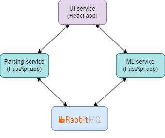

# YouTube Sentiment Analyzer
## Оглавление:
1. [Описание проекта](#project-description)
2. [Данные](#data-description)
3. [API HeadHunter](#api-description)
4. [Парсер](#parser-description)
5. [Аналогичные исследования](#similar-studies)
6. [Результаты](#results)

* Описание проекта
* Архитектара веб-приложения (Компоненты приложения, Поток данных)
* Источники данных
* Модель классификации
* Скриншоты
* Стек технологий
* Результаты

 
## Описание проекта
Проект представляет собой web-приложение, разработанное для анализа тональности комментариев, оставленных под видео на YouTube. Основной задачей приложения является предоставление пользователям инструмента для оценки общественного мнения о различных видео.

### Источники данных
Для обучения модели использовались следующий источники данных:

| Датасет | Описание | Аннотирование | Классы | Размер | Язык |
| --- | --- | --- | --- | --- | --- |
| [RuTweetCorp](https://web.archive.org/web/20200229080757/http://study.mokoron.com/) | Русскоязычный корпус коротких текстов, собранных на основе русскоязычных постов микроблогинговой площадки Twitter. | Автоматическое | 2 | 226834 | Русский |
| [Russian Hotel Reviews Dataset](https://www.kaggle.com/c/sentiment-analysis-in-russian) | Аспектный набор с примерами настроений из 50 329 русскоязычных обзоров отелей. | Автоматическое | 5 | 50 329 | Русский |
| [Kaggle IS161AIDAY](https://www.kaggle.com/c/is161aiday/discussion) | Набор с примерами настроений, опубликованный Alem Research. | не указано | 3 | 4229 | Русский |
| [IMDB](https://www.kaggle.com/datasets/lakshmi25npathi/imdb-dataset-of-50k-movie-reviews) | Набор данных, содержащий отзывы о фильмах с сайта IMDB. | Ручное | 2 | 50000 | Английский |

Общий объём датасета составляет 328,394 текстов. Основу датасета составляют данные RuTweetCorp. Для их разметки был применён метод автоматической классификации отзывов, предложенный Jonathon Read. Тексты были размечены на два класса с учётом следующих критериев:

* Исключение твитов, содержащих одновременно положительные и отрицательные эмоции.
* Исключение дублирующихся твитов.
* Исключение малоинформативных твитов (длиной менее 40 символов).

Из наборов текстов, имеющий более двух классов были исключены нейтральные тексты. Например, в случае 5 классов, тексты с метками 4 и 5 были отнесены к положительным, а тексты с метками 1 и 2 - к отрицательным.

Для классификации текстов на английском был добавлен набор данных IMDB.

### Обучение модели
Для обучения модели была использована библиотека FastText, которая предоставляет простой интерфейс для работы с методами обработки естественного языка, включая классификацию текста.

Также fastText предоставляет предварительно обученные векторные представления для 157 языков. В данном проекте использовались векторные представления для русского языка. 

Настройка гиперпараметров модели проводилась методом подбора по сетке.

**Оценка модели**. После завершения обучения модель была оценена на отложенной выборке. Полученные результаты показали точность классификации 95%.

### Скрин приложения

### Архитектура приложения

Web-приложение состоит из следующий компонентов:
*  **UI-сервис**. Этот сервис отвечает за представление пользовательского интерфейса.
*  **ML-сервис**. 
*  **Parsing-сервис**
*  **RabbitMQ**

**Стек технологий:**
* **ML**: Keras, FastText
* **Frontend**: React
* **Backend**: FastAPI
* **Брокер сообщени**: RabbitMQ
* **Контейнеризация**: Docker, Docker Compose
* **Оркестрация**: Kubernetes
