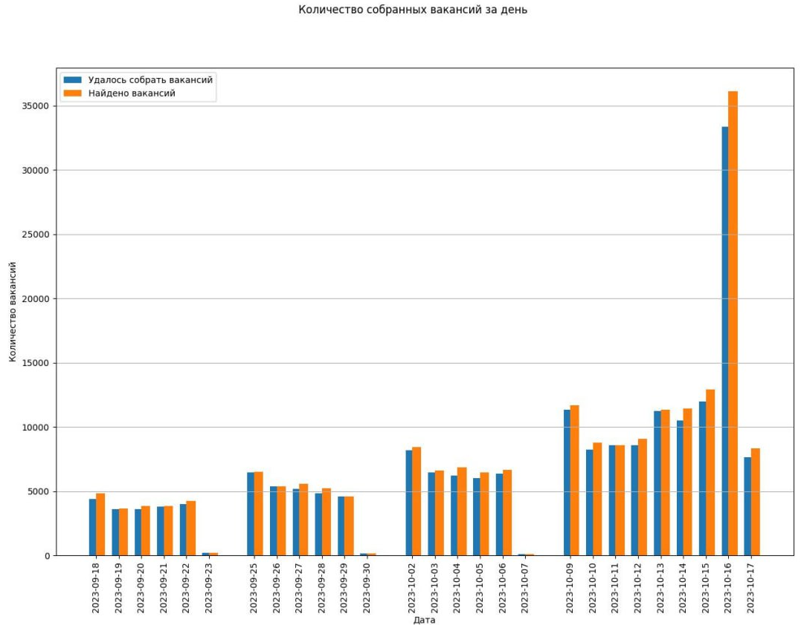
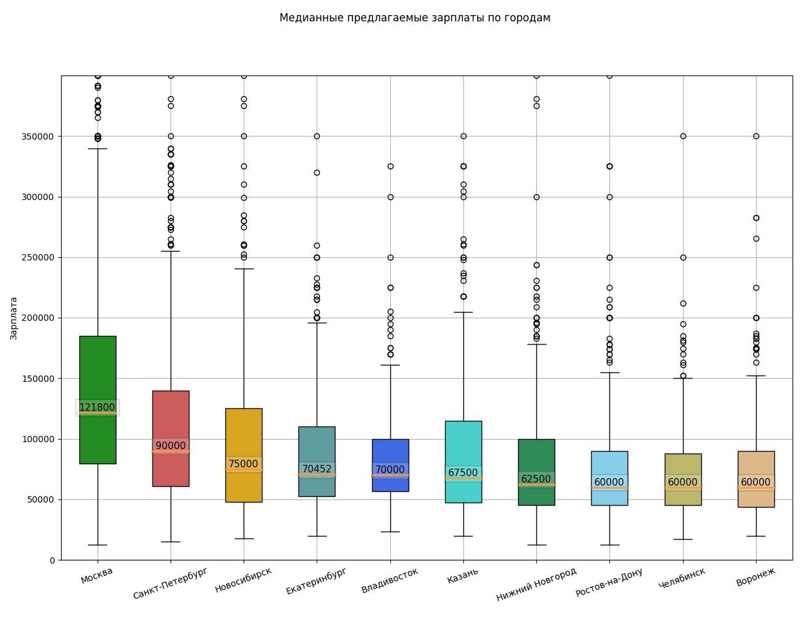
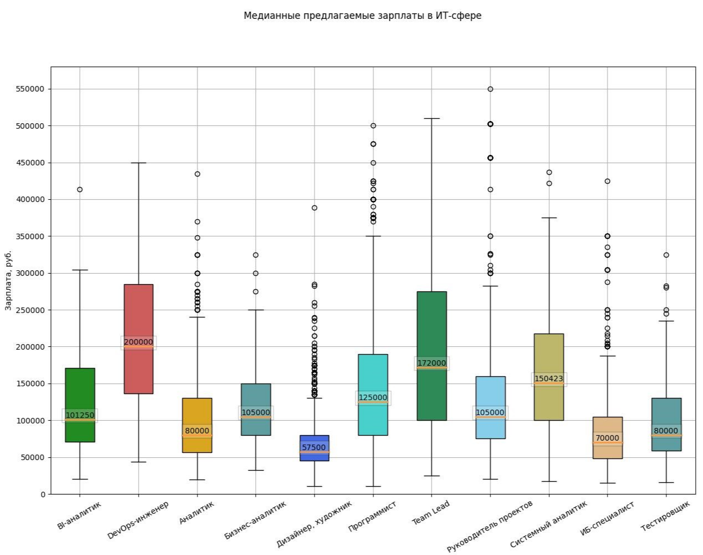
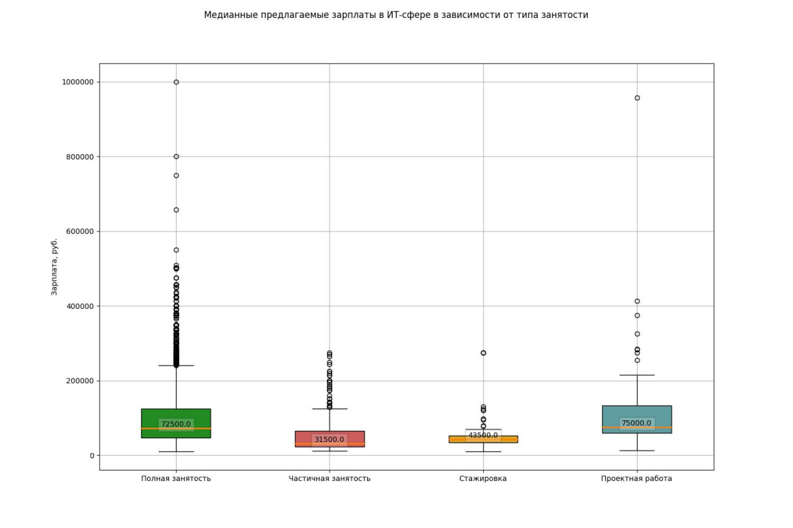
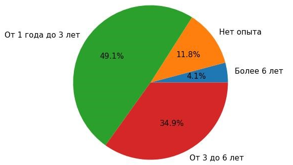
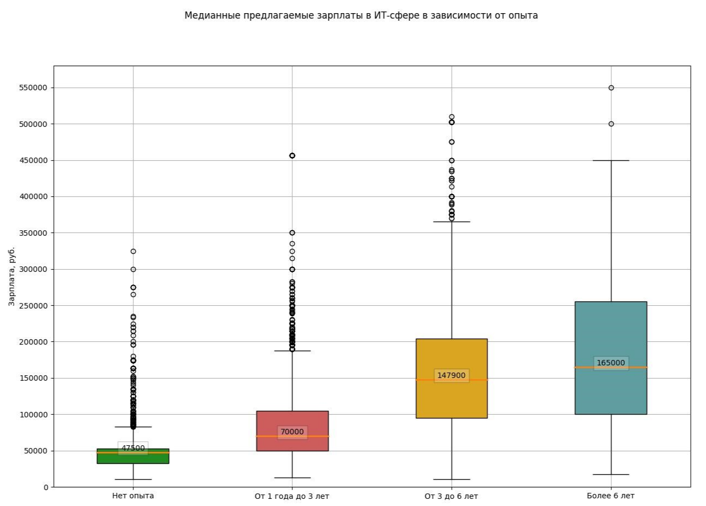
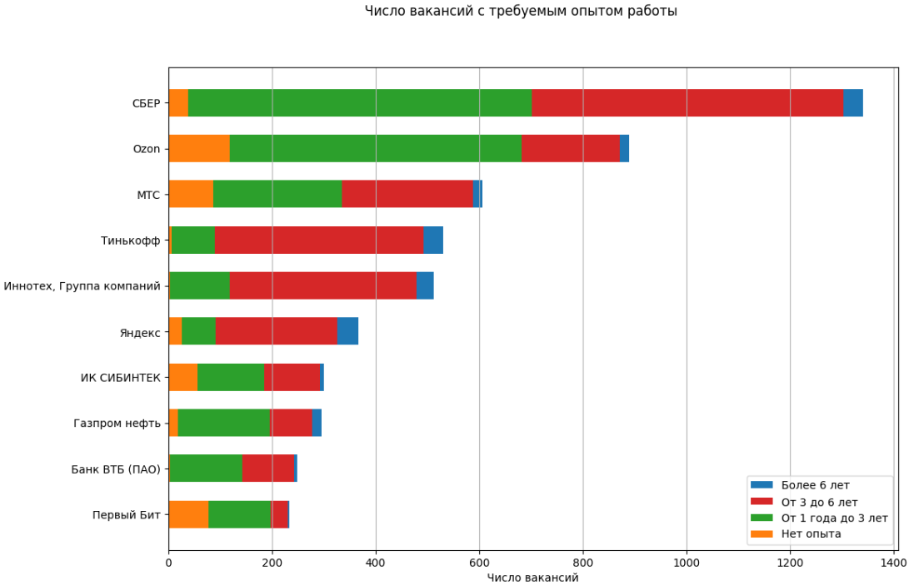
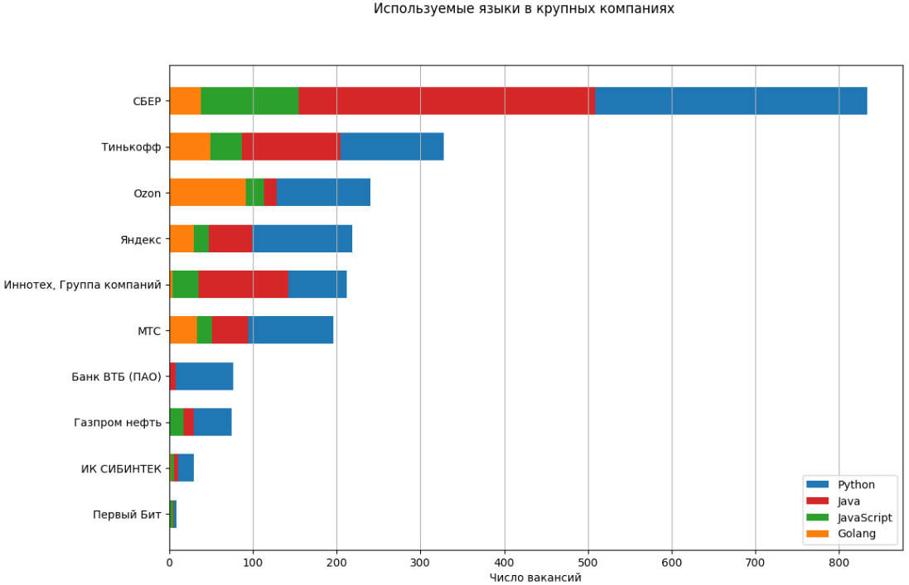
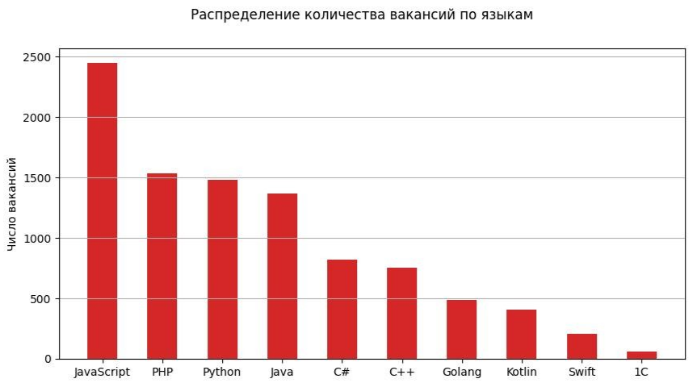
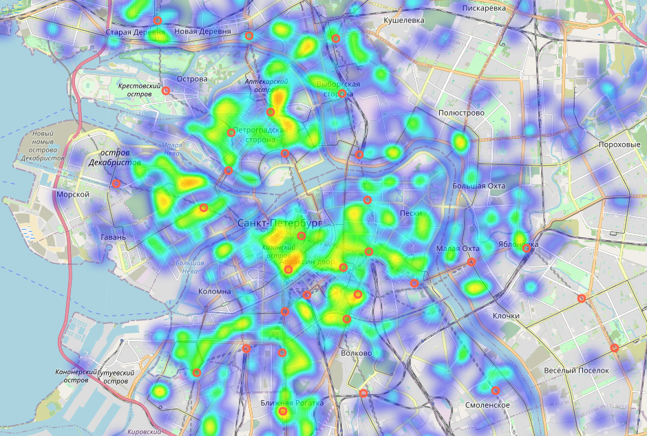

# Анализ рынка IT вакансий
## Оглавление:
1. [Описание проекта](#project-description)
2. [Данные](#data-description)
3. [API HH](#api-description)
4. [Парсер](#parser-description)
5. [Аналогичные исследования](#similar-studies)
6. [Результаты](#results)

### Описание проекта:

Основной целью данного проекта был анализ рынка вакансий IT-специальностей с использованием данных, предоставленных платформой HeadHunter, а также создание инструмента для анализа данных о вакансиях с использованием API HeadHunter, который позволяет эффективно извлекать и обрабатывать информацию о вакансиях.

### Данные

Для получения данных был написан парсер, использующий API HeadHunter.

Данные охватывают период с 18 сентября 2023 года по 17 октября 2023 года. Регионы: по всей России.

В результате удалось собрать 190880 вакансий (68770 IT вакансий). Количество фичей - 53.

На следующем рисунке представлено количество найденных за день вакансий, и сколько из них удалось скачать.

Собранные данныя я выложил в свободный доступ на Kaggle: https://www.kaggle.com/datasets/ilyazawilsiv/it-vacancies-from-headhunter-website

### API HH

**Ограничения API HH:**
* Ограничение на количество запросов: 10 запросов/сек/ip.
* Ограничение на количество возвращаемых результатов в одном запросе. При выполнении запроса можно получить не более 2000 вакансий.
* Можно выкачать вакансии только за последние 30 дней

**Используемые запросы:**
* GET /vacancies - возвращает список вакансий 
* GET /vacancies/{vacancy_id} - возвращает JSON с телом вакансии
* GET /professional_roles - возвращает список категорий и ролей

Параметры запроса, которые были использованы в проекте, представлены в следующей таблице.

| Параметр | Описание |
| --- | --- |
| page | Номер страницы |
| per_page | Количество вакансий на страницу. |
| professional_role | Профессиональная область. Необходимо передавать id роли. |
| date_from | Дата, которая ограничивает снизу диапазон дат публикации вакансий.  |
| date_to | Дата, которая ограничивает сверху диапазон дат публикации вакансий. |

### Парсер

Исходя из вышеуказанных ограничений API HH парсер сначала собирал id вакансий за переданный промежуток времени (запрос "/vacancies"), а уже после этого с помощью запроса "/vacancies/{vacancy_id}" получал тело вакансии.

Важной особенностью парсера является работа с временным интервалом при получении id вакансий. 
Так как параметры date_from и date_to в запросе "/vacancies" округляются API HH до ближайших пяти минут, 
то минимальный шаг, за который можно получать результаты, будет равен пяти минутам. Чтобы обойти ограничение на количество возвращаемых результатов в одном 
запросе (2000 вакансий), был использован переменных шаг. Стандартный шаг, за 
который производился сбор вакансий, равняется 30 мин. Если в одном из 
промежутков было найдено более 2000 вакансий, то данный промежуток 
дополнительно разбивался на более мелкие с шагом в 5 мин.

### Аналогичные исследования

Из наиболее интересных аналогичных исследований можно выделить периодически публикуемые  HeadHunter исследования IT-рынка вакансий. Например, отчеты за 2018 и 2023 год.

Из особенностей [отчета за 2023](https://hh.ru/article/31783) год можно выделить анализ динамики уровня конкуренции за рабочие места с 2021 по 2023 год, а также анализ уровня конкуренции по языкам программирования и основным IT-профессиям. 

[Отчет HeadHunter за 2018 год](https://hh.ru/article/24562) интересен тем, что предоставляет 15 портретов представителей IТ-специальностей.

## Результаты

Распределение опыта

Тепловая карта вакансий СПБ

